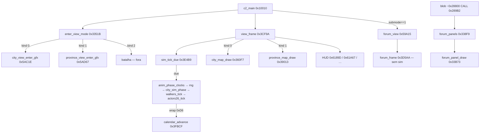

# Cidade / Província / Forum — mapa do código

Começo (não um decompile completo). Quando estás **dentro** de cada entidade, estas funções correm. Layout de `HISTORY.DAT` / escalares de Week: outros docs — aqui só o **código da view**.

`c2_x.bin` base `0x10000`. Watcom: EAX, EDX, EBX, ECX.

**Irmãos:** tick de walkers `ghidra_walkers_tick.md` + `ghidra_sim.md` · tiles cidade `ghidra_city.md` / `ghidra_tile.md` · mapa 60×60 `province_map.md` · forum ficheiros/strings `forum.md` · data HUD `sav_date.md`.

---

## Comparação (o que corre em cada um)

| | **Cidade** | **Província** | **Forum** |
|---|:---:|:---:|:---:|
| Como entra | `view_kind` **0** + `enter_view_mode` | `view_kind` **1** + `enter_view_mode` | `view_submode` **1** → `forum_view` (**não** `enter_view_mode`) |
| Loop por frame | **`view_frame` `0x3CF9A`** | **o mesmo `view_frame`** | `forum_view` → `forum_frame` **ou** `forum_panels` (dois caminhos) |
| `walkers_tick` `0x459D0` | sim (pulso) | **sim (o mesmo pulso)** | não |
| `actors26_tick` `0x45A7A` | sim (pulso) | **sim** (e **desenha** os sprites) | não |
| `calendar_advance` `0x3FBCF` | sim (wrap da `city_sim_phase`) | **sim** (mesmo pulso) | não |
| `economy_recompute` `0x3FCA0` | no init / fase, não no HUD | igual (partilha o pulso) | não neste loop |
| Draw iso | `city_map_draw` `0x360F7` | `province_map_draw` `0x39013` | nenhum |
| UI modal | HUD por cima do mapa | HUD por cima do mapa | **sim** (chrome / painéis) |
| Batalha (`kind` 2) | — | — | **fora de âmbito** (`FUN_0004aaee` tem loop próprio) |

Cidade e província **não** são dois sims. Trocar a view só muda métricas, SFX, gfx e o ramo de draw. Walkers da cidade continuam a andar enquanto olhas o mapa provincial.

---

## Grafo (entrada → frame)



---

## Como o `c2_main` escolhe

Loop interior (`0x1035E`–`0x103AC`), já listado em `ghidra_walk.md`:

1. `enter_view_mode` `0x3351B` (uma vez por sessão de view).
2. Enquanto `session [0xCCAFF8]==0` e `quit [0xCCAFF7]==0`:
   - se ainda na “city extras”: **`view_frame` `0x3CF9A`**
   - depois `combat_mode4_step` `0x10409`
   - se `view_submode [0x102AA4] != 0` → `session=1` (sai do `view_frame`)
3. Se `view_submode == 1` → **`forum_view` `0x59A15`**

Bytes:

| VA | Chunk | Nome | Papel |
|---|---|---|---|
| `[0x117A8D]` | 0 | `view_kind` | 0 cidade / 1 província / 2 batalha |
| `[0x102AA4]` | 370 | `view_submode` | 0 play · **1 forum** · 2/3 early RET · 4 combate |

Quem **grava** `view_kind` (amostra): `city_view_reset` (0), `switch_to_province` `0x3179D` (1), `switch_to_city` `0x3168C` (0), `FUN_0004aaee` (2, batalha). Clique Forum **não** passa por `enter_view_mode`.

---

## 1. Cidade

### Entrar

`view_kind == 0`. Caller principal: `c2_main` após `city_view_reset` / load. Troca a partir da província: **`switch_to_city` `0x3168C`** (grava kind 0, chama `enter_view_mode`, recentra câmara num índice da LUT `0x103BCC`).

`enter_view_mode` (kind 0): métricas 80×80 (`0x50`), altura 480; `city_sfx_bind_wavs` `0x12F2A`; **`city_view_enter_gfx` `0x5AC1E`**.

### Pipeline por frame (`view_frame` `0x3CF9A`–`0x3D3E5`)

Ghidra ainda funde até `0x10CF67`. Parar no primeiro `RET` `0x3D3E5`. Lista de `CALL` extraída do binário (não do C).

| # | VA | Nome | Trabalho |
|---|---|---|---|
| 1 | — | `INC [0xC45B4]` | contador de frame |
| 2 | `0x27372` | `timer_delta_ms` | `dt` → `[0xC4CD0]` |
| 3 | `0x3E4B9` | `sim_tick_due` | gate de velocidade; 0 = saltar o pulso |
| 4 | `0x27F31` | **`anim_phase_clocks`** | relógios mod 4/8/16/32/64/128/256 (não é AI) |
| 5 | `0x2804C` | `rng_clock` | `[0xC2070] = rand & 0x7F` |
| 6 | `0x3F60C` | `city_sim_phase` | **um** slot `[0x1026A8]`; wrap `> 0xD6` → `calendar_advance` |
| 7 | `0x459D0` | `walkers_tick` | 201×58 @ `0x1107A4` chunk 8 — **`ghidra_walkers_tick.md`** |
| 8 | `0x45A7A` | `actors26_tick` | 26×175 @ `0x114500` chunk 7; skip se `[0x9CE81]` |
| 9 | `0x25F26` | **`input_poll_cursor`** | rato / cursor |
| 10 | `0x25C13` | **`input_poll_buttons`** | bordas L/R (`[0xCCB10]` click, `[0xCCB12]` release-ish) |
| 11 | `0x62341` | `FUN_00062341` | chrome de data se `[0x102AB0]` mudou (**não** caçar Week aqui) |
| 12 | `0x360F7` | `city_map_draw` | **só se kind==0** |
| 13 | `0x39013` | `province_map_draw` | **só se kind==1** e `[0xCCB09]!=5` |
| 14 | `0x6189D` | `FUN_0006189D` | HUD tesouro `[0x102AAC]` + mês |
| 15 | `0x61A67` | `FUN_00061A67` | HUD texto / query |
| 16 | `0x589B5` | `FUN_000589B5` | faixa de mensagem se `[0x102C54]` |
| 17 | `0x61C56` / `0x5B6D1` / `0x62451` / `0x5BABF` / `0x5BE03` / `0x60405` | FUN_ | mais HUD / overlay — **ainda blob** |
| 18 | `0x3ED57` | **`view_kind_overlay`** | kind0 → `FUN_0003ed7c` · kind1 → `FUN_0003f063` |
| 19 | `0x5B8ED` | `FUN_0005B8ED` | refresh do chrome (cidade vs província vs batalha) |
| 20 | `0x25E99` | `FUN_00025E99` | clamp do cursor no ecrã |
| 21 | `0x25D7A` | `FUN_00025D7A` | blit do sprite do cursor |
| 22 | `0x28DCE` | `FUN_00028DCE` | ? |
| 23 | `0x29849` | `video_blit_dirty` | apresenta |
| 24 | `0x273CA`…`0x1211E` | vários FUN_ | pós-blit / reload — **não aberto** |

Pulso 4–8 só corre se `sim_tick_due` = 1, **1×** se `[0xC45A0]==0` senão **4×**. Se `view_submode ∈ {2,3}` no meio do pulso: RET precoce.

### Dados que lê

| Chunk | VA | O quê |
|---|---|---|
| 13 | `0xE2FBC` | mapa 80×80×20 (draw + `city_sim_phase`) |
| 8 | `0x1107A4` | `walker_pool` |
| 7 | `0x114500` | `actor26_pool` (tick; draw de walkers é o pool 8) |
| 28 | `0x102AAC` | tesouro (HUD) |
| 25 / 26 | `0x102AA0` / `0x102A88` | ano / mês — **`sav_date.md`** |
| 0 | `0x117A8D` | ramo city vs province |

### Input (1 hop)

`input_poll_cursor` + `input_poll_buttons`: rato, não teclado. Teclas / hitboxes do chrome (Forum, Cidade↔Província) estão num **blob sem função** ~`0x28800`–`0x33900` (`CALL enter_view_mode` @ `0x28981`, `CALL switch_to_city` @ `0x3381C`/`0x338E9`, `CALL switch_to_province` @ `0x3387E`/`0x338F1`). Clique Forum: candidato `0x289B2` → `forum_panels` (irmão mapeia o botão).

### Draw vs sim

- **Sim:** só o bloco `sim_tick_due` → fase → walkers → actors.
- **Draw:** `city_map_draw` = contadores de anim + `city_map_draw_terrain` `0x361DC` + `city_map_draw_walkers` `0x364A0` + `city_map_draw_overlays` `0x365CC`. Não é um tick.

### Ainda FUN_

Quase todo o HUD depois de `0x61A67`. `FUN_00027BFA`, `FUN_00035350`, `FUN_000358C2`, `FUN_0002D25A`. Fase slots dentro de `city_sim_phase`: tabela em `ghidra_sim.md` §5.

---

## 2. Província

### Entrar

`view_kind == 1`. **`switch_to_province` `0x3179D`**: se ainda não estava em 1, grava kind, chama `enter_view_mode`, aponta a câmara para um tile da LUT `0x103BCC` (zoom 0/1/2 ajusta offset).

Callers de `switch_to_province`: blob `0x334DE` / `0x3387E` / `0x338F1`, e **`FUN_0005429C`** (modal: SFX, switch, `province_map_draw`, loop `FUN_0003de73` até `[0xC459C]` — caminho “saltar para a província e esperar”, ainda opaco).

`enter_view_mode` (kind 1): métricas `0x3C` (60); **`province_sfx_bind_wavs` `0x13187`** (`birdsp*`, `mining`, `surf`, `shore`, `shipyrd`, `warehse`, `quarry`, `trading`, `march*`, `uprise`, `farm`); **`province_view_enter_gfx` `0x5AD67`** (load_file × chrome, `province_map_draw` uma vez, HUD, blit).

### Pipeline por frame

**O mesmo `view_frame`** da cidade. Única diferença no draw: `province_map_draw` em vez de `city_map_draw`.

`province_map_draw` `0x39013`:

| Ordem | VA | Nome | Trabalho |
|---|---|---|---|
| 1 | `0x12A6C` | `FUN_00012A6C` | ? (também no blit de actor) |
| 2 | `0x39032` | **`province_map_draw_tiles`** | 60×60: id `< 0x7D` LUT terreno `0x97B40`; `≥ 0x7D` `FUN_00039DCD` (edifícios) |
| 3 | `0x392C7` | **`province_map_draw_overlays`** | edifícios extra `FUN_0003A003` + **`province_draw_actor26` `0x3AB6D`** (lê tile[+7] = slot actor26, blit `MY_STDS.PL8`) |

Exército / navios / mercadores **não** têm um tick à parte. São types 1–8 de `actors26_tick` (dispatch `0x99D44`). O draw provincial é que os mostra. Host sem `actors26_tick` = mapa morto (`app_tick.md`).

### Dados que lê

| Chunk | VA | O quê |
|---|---|---|
| 14 | `0xD94FC` | `prov_tiles_60x60x8` — `province_map.md` |
| 7 | `0x114500` | actors (exército / navios); tile[+7] aponta o slot |
| 335 | `0xD2AEC` | goods (não no draw; sim + forum kind 7) |
| 13 + 8 | cidade | **continuam a ser tickados** mesmo nesta view |

### Input

Igual à cidade (`input_poll_*` no `view_frame`). Clique em Your City (`id 0x92`) / troca de mapa: `switch_to_city` / `switch_to_province` (LUT 81×161 @ `0x103BCC`). Tecla exacta: blob ~`0x33800`.

### Draw vs sim

- **Sim:** partilhado (fase cidade + walkers + actors + calendário).
- **Draw:** só o 60×60 + sprites actor26. Walkers da cidade **não** se desenham aqui.

### Ainda FUN_

`FUN_00039DCD` (edifício provincial), `FUN_0003A003`, `FUN_0003DE73` (loop do modal `0x5429C`), `FUN_0003F063` (overlay kind 1). Types actor26 1–8: tabela em `ghidra_sim.md` / walkers — não reabrir aqui.

---

## 3. Forum

Duas entradas. Nenhuma usa `enter_view_mode`.

### A. Kick / Império — `forum_view` `0x59A15`

`c2_main` quando `view_submode==1`. Quem grava 1: amostra em `forum.md` (`FUN_00033D21` rating, `FUN_00054DC5` tesouro&lt;0 no mês, `FUN_00058D31`).

```
[0xCCB09]=0
FUN_0001239C          ; Miles / handles
forum_view_setup 0x59A71   ; palette, moldura, blit
[0xC459C]=0
FUN_000135A4
while [0xC459C]==0:
    forum_frame 0x3D5AA    ; NÃO é view_frame
FUN_000121A9
FUN_0005A9FC               ; teardown
```

`forum_frame` `0x3D5AA`:

| Ordem | VA | Nome | Trabalho |
|---|---|---|---|
| 1 | `0x3CF69` | **`input_frame_prefix`** | `++frame`, `input_poll_cursor`, `input_poll_buttons`, `rng_clock` |
| 2 | `0x25E99` | `FUN_00025E99` | clamp cursor |
| 3 | `0x25D7A` | `FUN_00025D7A` | blit cursor |
| 4 | `0x28DCE` | `FUN_00028DCE` | ? |
| 5 | `0x29849` | `video_blit_dirty` | apresenta |

**Zero sim.** Sem walkers, actors, fase, calendário. A cidade fica congelada.

### B. Painéis ricos — `forum_panels` `0x338F9`

UI Ratings / Scribe / Empire / Industry. **Não** é chamada de `forum_view`. Xref: `0x289B2` (chrome sem bounds) + tabelas `0x99748` / `0x997A8`.

```
input_frame setup, music, FUN_0005D308 (forum.pl8 / .256 / forumbit)
forum_panel_draw 0x33B73          ; kind [0x117A5C]
while [0xC459C]==0:
    forum_panel_input 0x33B06     ; por kind
    hitmap 80-wide @ regions_or_history_ptr+120000 → [0x117A5C]
    se click: forum_panel_draw de novo
sair: city_view_enter_gfx ou province_view_enter_gfx
```

`forum_panel_draw` no Ghidra está **fundido** com código em `0x5D3xx`–`0x60Fxx` (bounds maus, como `view_frame`).

### Painéis (`[0x117A5C]`) — start, não completo

| Kind | C2.ENG (palpite) | O que o C lê | Conf |
|---:|---|---|---|
| 0 / default | 12× `FUN_0003DDF7` (rótulos) | — | med |
| **1** | **[31] Your Ratings** | tesouro `0x102AAC`; `FUN_0005D892` / `FUN_0005DBAD` (ano) | high |
| 2 | [32] Scribe? | rank `[0x102578]`; `FUN_0005E0E3` | low |
| **3** | carreira / histórico | **`history_dat_read` `0x70B76`** (`open_`/`read_` `history.dat`) + `FUN_0005F18E` / `FUN_0005F2E0` | high que lê o ficheiro; **layout = irmão** |
| 4 | texto | vários `FUN_00026F16` | low |
| 5 | [69] Promotion? | `load_file` (+ `FUN_00057A47` no click 5) | med |
| 6 | [33] Empire / comércio? | `FUN_00053AB1` / `0x55DC1` / `0x604F4` / `0x5FE7A` / `0x5FCB1` | med |
| **7** | **[35] Industry** | 8 linhas de **`0xD2AEC` chunk 335** + tabela `0xD2B6C` chunk 339 | high |
| 8 | saldo / [34] Legion? | `[0x102A84]`; `FUN_00060F51` / `0x6111D` | low |
| 10 | load extra | vários `load_file` + `FUN_0005E9E5` | low |
| 11 | ? | `FUN_0005F8B8` | low |

Right-click / `[0xCCB12]` na maior parte dos kinds volta ao kind 0 (`[0xC459C]=2` → redesenha). Kind 9 = sair (`[0xC459C]=1`).

### Dados

Arte e `C2.ENG`: `forum.md` §4–5. Chunk 335 / tesouro / ratings: acima. **Não** decodificar `HISTORY.DAT` aqui.

### Input

Painéis: `forum_panel_input` (mesmo `input_frame_prefix` + hitmap). Loop fino: só cursor. Tecla Forum na cidade: **ainda não isolada** (`0x289B2` é o candidato).

### Draw vs sim

Tudo draw/UI. Sem iso. Sem pulso de sim.

### Ainda FUN_

Quase todos os `FUN_0005D*` / `5E*` / `5F*` / `60*` por painel. `FUN_00059C86` vazio no decompile. Hitmap `ptr+120000` opaco (`forum.md`).

---

## Nomes aplicados nesta sessão (GhidraMCP)

| Nome | VA | Era |
|---|---|---|
| `province_map_draw` / `_tiles` / `_overlays` | `0x39013` / `0x39032` / `0x392C7` | `FUN_00039013`… |
| `province_view_enter_gfx` | `0x5AD67` | `FUN_0005AD67` |
| `province_sfx_bind_wavs` | `0x13187` | `FUN_00013187` |
| `province_draw_actor26` | `0x3AB6D` | `FUN_0003AB6D` |
| `forum_frame` / `forum_view_setup` | `0x3D5AA` / `0x59A71` | `FUN_0003D5AA` / `59A71` |
| `forum_panels` / `forum_panel_draw` / `forum_panel_input` | `0x338F9` / `0x33B73` / `0x33B06` | `FUN_000338F9`… |
| `switch_to_city` / `switch_to_province` | `0x3168C` / `0x3179D` | `FUN_0003168C` / `3179D` |
| `anim_phase_clocks` | `0x27F31` | `FUN_00027F31` |
| `input_poll_cursor` / `input_poll_buttons` / `input_frame_prefix` | `0x25F26` / `0x25C13` / `0x3CF69` | `FUN_00025F26`… |
| `view_kind_overlay` | `0x3ED57` | `FUN_0003ED57` |
| `history_dat_read` | `0x70B76` | `FUN_00070B76` (só I/O; sem campos) |

Comentários de pipeline nos três roots + `province_map_draw`.

---

## Buracos (de propósito)

- Definir funções no blob `0x28800`–`0x33900` (teclas / botões Forum e Cidade↔Província).
- Cada type de `actors26` (exército vs navio vs mercador).
- Cada kind de forum até ao último `FUN_0005xxxx`.
- Redefinir bounds de `view_frame` e `forum_panel_draw` no Ghidra.
- Week / `HISTORY.DAT` campo-a-campo — **não aqui**.
- Host: sem UI de forum; `view_frame` no Python ainda não existe (`app_tick.md` só `walkers_tick`).
